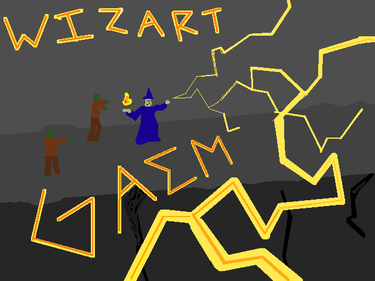
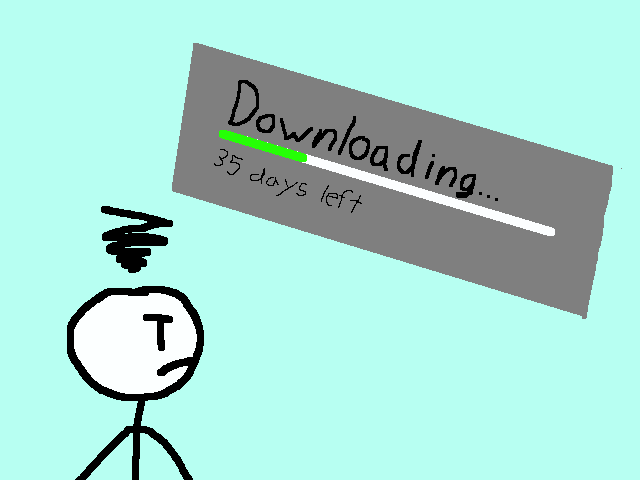
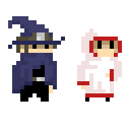
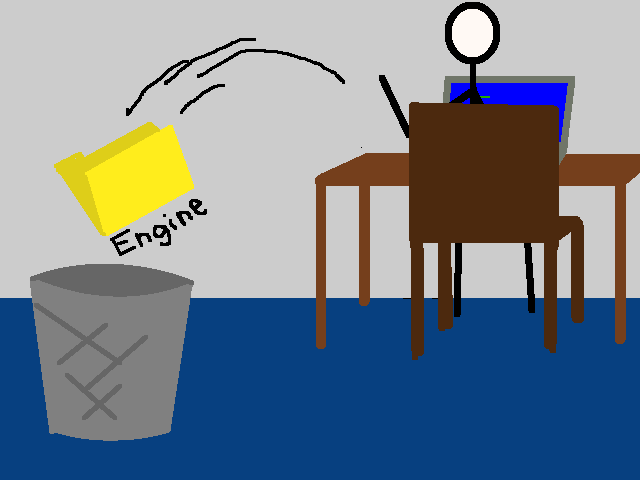
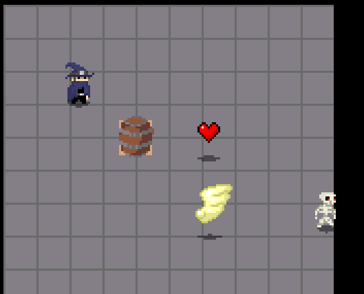

# Wizart Gaem

### We're back at it again
Work has started on a third game, and it's not just mine this time. May I introduce...

## The Team, POGLAW
Pascal King - the art / the brains  
Owen Wolman - well versed in the trade  
George Khankeldian - he's george  
Laura Garling - the cool one  
Andrew Castelino - wants to do the music(?)  
Will Campbell - had the idea (and will provide moral support)

I'll be working with these wonderful folks to make a much bigger project than the ones before! We're still early on in development, so no builds 
to show yet. This will only be a log for now. Keep on coming back to see what we can do!

[Back to the Castle](https://whcampbell.github.io/Ivys-Castle/)

### Meeting 1 - 9/17/20
For the first part of the meeting, Pascal, Owen and I built up the design doc, discussing possible creative and gameplay ideas. Our plan is a top-down 
magical survival game. The player will have to use various spells and manage their mana in order to fight back the approaching enemy horde 
while navigating an expanding map.

Once everybody got to the office we began with the housekeeping and setup work. First we decided upon VSCode as our IDE. After that there was 
much sharing and inviting, including a github repo, trello board, and the design doc. Owen also got us rolling on GitKraken. Since some of us
hadn't used any of this stuff before (me included, I'd never used trello or kraken), Pascal and Owen stepped in to give some lessons. Pascal
gave us a quick explanation for trello and Owen did the same for Kraken. Pascal then started on the setup for the repo, building up the vital 
structures for engine, rendering, etc. My important contribution was the decision of the trello board's background. 

A successful first day. 

oh yeah I also drew this

### Meeting 2 - 9/24/20

We were trying a while to get things to compile, but it was difficult to do across multiple platforms. Andrew and Pascal were doing most of the heavy
lifting on that, researching CMake to get a makefile going. Pascal also set up the code to have a game window pop up, but it couldn't be compiled
for the aforementioned reasons. The people using mac had to do some research on gcc (g++ really) that we could use. It wasn't going all too well,
the download for clang took about five million years and there was nothing else we could do but sit around. We're all excited for when we get out
of these woods here so that we can get to some normal programming and not twiddling our thumbs waiting on new software. 

### Meeting 3 - 10/1/20

Very brief meeting today, still working on compilation. The mac people all got cmake downloaded, but xcode was being iffy. We needed Owen to lead
us in our journey through the downloads and updates. Laura and I had yet to get xcode, but I needed an OS update and Laura was just having
issues with the download on that bad boy. Therefore both of our computers were out of commission. Andrew was working on the makefile once again, 
but he needed to get his combinatorics done so he couldn't work long. Pascal set up a metafile generator for importing sound effects and sprites, 
he's MVP today.

### Meeting 4 - 10/8/20

Finally got C++ to compile on mac. This took way too long. Owen was correct that what we needed to do was download xcode so as to get all the 
necessary libraries. After that it was just installing the c++ extension on vscode and the hello world was off to the races. Pascal, Owen, George 
and I then made some creative decisions. Pascal had drawn up some concept art for the main character and we all decided on which option we liked,
and then we decided that we wanted random rogue-esque room generation. We had to go through some issues of this though, mostly scalability.
This map could grow real big, and in order to save it we had to do something about efficiency. Our decision was to select rooms randomly from a 
pool. The map will be made of tiles, however, so when a room is added it is no longer a room, it is just a bunch of tiles. Then, when the map is
saved, it just needs to be compressed down. We decided that rooms could be created without a GUI, and then they can be loaded with a set-size 
chunk system. I wanted to look up alternatives, but google failed me. Turns out not many people are trying to be indie game developers. Ope. 

Owen also got a new role. He is now the creative writing lead! He wanted some story, and I thought that putting some lore collectibles in the 
game would flesh it out a bit so I agreed. Andrew was dealing with cmake still, he concluded that no intelligent person has ever used cmake. 

p.s. Owen is also the programming director. He also has the right to hand that role off like a hot potato. Will remains creative director. 

In fact, lets assign the roles. 

Pascal - Art Director, Game Dev Expert, Engine Lead  
Owen - Writing Director, Programming Director  
George - Associate Developer  
Laura - Associate Developer  
Andrew - Music Director, Compilation Expert, Associate Developer  
Will - Creative Director, Associate Developer  

p.p.s. ONION MAN

### Meeting 5 - 10/15/20

Pascal continued to be the boss of linking and engine setup over the past week. He did the grunt work on getting things to build on mac. A round of 
applause was given to Pascal for his worthy efforts. We also decided to set down some story stuff. Owen raised a few ideas and Pascal put one up as 
well. All this is just to give context to the world: who are we, who are the enemies we're fighting, why are you in the place where you are, et 
cetera. We thought that we could have a narrator trying to kill the player. This way we could spice things up by changing the setting, since the 
world is at the narrator's fingertips. Pascal and I also had some discussion about mechanics, such as what environmental effects we want, spell
interaction, and the mechanics which would force the player to explore. 

New issue came up that things would build on my mac, but not on Owen's. Just needs to update xcode for a better clang version, but needs to 
update his OS first (like what happened with me). Laura is also getting things set up. Update: her build worked just fine. Owen (being the programming
director) and Pascal (being the game design expert) are gonna divide the design into programming tasks for all of us to start working on. From that
point, we'll be able to really get down to the brass tacks. 

### Meeting 6 - 10/22/20

Going through standup, nobody did much once again since the base/engine of the game hadn't been built up yet. Pascal, being the engine master man,
DID go pretty hard this week on knocking out the initial work. There are a few bugs with building the project but things are going pretty well.
Pascal worked out drawing to the screen, playing music, and keyboard inputs. Pascal also educated us on how to work his engine and went through
a test entity. Aside from that, not much. Splitting up the tasks on trello should happen very soon, and work shall be done. 

### Meeting 7 - 10/29/20

The green light has been given! Pascal has told us that everything we need to start coding is set down. We just need to get familiar with the 
documentation and get warmed up with how to use his engine. For the first part of the meeting we figured out the first set of tasks we need to
start on. We went through the design doc to get a bunch of trello tickets going. We worked on how we wanted the UI to look, such as the 
health, mana, and XP bars and the spells as well. After that we split up the tasks. I'm going to build up the class structure for spells, Pascal is 
going to take item drops, I believe Laura is going to take the enemies, Owen is going to work on procedurally generating rooms, and I'm not sure
what George and Andrew are doing. They're probably just gonna take whatever they like off the trello pile. I'm excited to finally get things going!
Just gotta warm up my C++...

### Meeting 8 - 11/5/20

I kinda dropped the ball this week by not getting around to doing much. Turns out everyone had a pretty busy Halloweekend, and Owen couldn't get 
Xcode working. Owen did do some research on integrated databases though, he's going to be messing with SQL (good for C and C++) to get things 
saved real nice. Pascal, being the expert, was hard at work as usual. He drew up some sprites for mana, an enemy, and other item drops, and he 
also did some more engine setup. As project leader, I need to stop Pascal from working. I have banished him to the art realm. He has given me no 
guarantees. Andrew also has an idea for what he wants the sound of the game to be musically, and I'm excited to see what he's got.

Now that we're splitting up to search for clues, Owen gave us the info on branching so we don't destroy the world. We then did a little more 
messing with build on mac (turns out pascal yote the whole engine, thanks version control for getting it back), and now it works like a charm. 
Since Laura and I were kinda daunted by the project the group decided that we should work together on something to figure out how this
whole programming thing works. Laura and I will be coming back to the office on sunday to get some knowledge on coding and project structure 
and we'll get started on a couple of the item drops to help us learn. 

### Mini-Meeting - 11/8/20

Pascal Laura and I hopped on discord this evening to get some stuff done. Pascal walked us through the structure of his quasi-Entity-Component 
system and we programmed up a couple items on our own. I was doing health, and I had it easy because I could just rip off the mana drop that 
Pascal had already made. Laura took a more difficult route with the Exp drop because we decided that all Exp is gonna be in a big shared pool, 
unlike health and mana which are gonna be separate for each player. Went quite well, I feel pretty good to have my first real code pushed up
to the project. 

### Meeting 9 - 11/12/20

Over the past week we started heating up. Laura and I did our item stuff, Owen made our shiny brand new integrated database, and Andrew brushed up
on mixing to make the music sound pretty. Pascal also did his normal ton of work over the week. He restructured the engine (again) to make sure 
that all the engine stuff we shouldn't see is behind an abstraction wall. He also made a particle system and it's currently showing numbers for
damage when we hit stuff. It's also crashing the game. That should change soon enough. 

Yeah, by the end of the meeting Pascal fixed the particle crashing issue. Apparently the multithreading was bonking itself because it would delete
the object before it got done rendering it (I think, I don't perfectly remember what he said it was). I also knocked out the speed boost drop. It
took a little more production than the health drop because I had to make a new component for buff timers and mess with the player files. I made 
a goof at one point and our little mans began to go at light speed. Ope. Anyways, Andrew started work on random room generation, and Owen and 
Laura were ironing out the experience drop some more. 

I guess George was busy this week. 

### Mini-Meeting 11/15/20

We were all able to get into the same room this time after a while of one or two of us having to discord in. We had a good head of steam going, so 
we all just broke out into our own little projects. Owen kept working on the integrated database with SQL, and Laura finished up the XP drop, 
getting her first commit up on the board. Andrew was working on the tiling of new rooms for procedural generation, and Pascal continued to be big 
brain guy and answered all our questions. What I want right now is to start burning through spells, because I found it was simple enough to kinda 
plug and chug for the item drops. I had to write in the skeleton enemy as a target though. I think my current mission is actually to add features 
to him like a hurtbox (which I should have done already, ope) and a physics driver for the knockback. 

### Meeting 10 - 11/19/20

Owen has a whole sector of the databases done. We decided that we only needed three, one each for mobs, spells, and items. He has the mob one all 
set up. After getting the other two done he's gonna write up helpers to allow the rest of us to easily interface. Andrew's been experimenting with
tiling and he has random generation of one room down. I believe he'll be working on stringing rooms together next. George was back with us this 
week, he's gonna get warmed up by doing item drops for the point system. Oh yeah, I guess we're gonna have a point system to see how well you did
after a run. Pascal is working away at some bugs and also being the font of knowledge that he usually is. Laura is following up on her XP drop and
worked on the display for XP, she's gonna make a nice bar. I coded up a physics component, mainly just for objects to slide around after they 
get hit by stuff. Took a little messing around with the bugs but I'm pretty happy with it. It's starting to look a bit like a game. Maybe I'll make
some recordings and put them up on youtube to give updates... Anyways, here's a good still.

